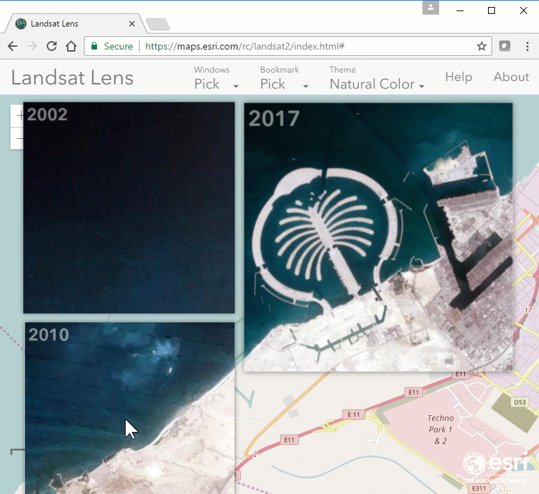

# Landsat Lens

Welcome to [Landsat Lens](https://richiecarmichael.github.io/landsat2/index.html), a touch and mouse friendly application for browsing past and present [Landsat](https://landsat.gsfc.nasa.gov/) satellite imagery hosted by [USGS](https://www.usgs.gov/) [here](https://landsatlook.usgs.gov/arcgis/rest/services/LandsatLook/ImageServer).

Click [here](https://richiecarmichael.github.io/landsat2/index.html) for the live application.

The application was built using the following technologies:
- [ArcGIS API for JavaScript](https://developers.arcgis.com/javascript/) by [Esri](https://www.esri.com)
- [Bootstrap](https://getbootstrap.com/) by [Twitter Inc](https://twitter.com/)
- [jQuery Throttle / Debounce](https://github.com/cowboy/jquery-throttle-debounce/) by [Ben Alman](https://github.com/cowboy)
- [jQuery](https://jquery.com/) by the jQuery Foundation Inc.
- [jQuery Mouse Wheel](https://github.com/jquery/jquery-mousewheel/) by the jQuery Foundation Inc.

Credit must also be given [Yannick Albert](https://github.com/yckart) who's [jQuery Touch](https://github.com/yckart/jquery.touch.js) libary was a useful reference.

The [USGS](https://www.usgs.gov/)'s [Landsat program](https://landsat.usgs.gov/) has been imaging the Earth for the past 45 years (see [wiki]https://en.wikipedia.org/wiki/Landsat_program()). Click [here](https://www.esri.com/software/landsat-imagery), [here](https://www.esri.com/landing-pages/software/landsat/unlock-earths-secrets) and [here]('http://www.arcgis.com/home/item.html?id=d9b466d6a9e647ce8d1dd5fe12eb434b) to learn more about the Landsat imagery hosted by Esri and specifically the recently announced [Landsat Explorer](http://landsatexplorer.s3-website-us-west-2.amazonaws.com/) app.